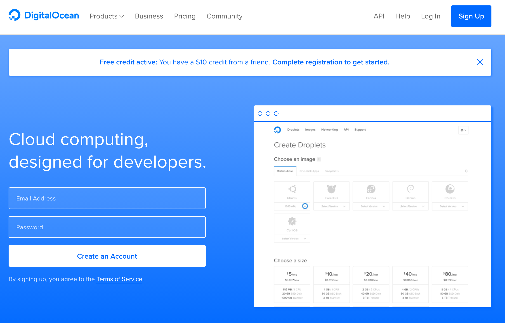

# Nephology

> I saw a city in the clouds. - Dagobahnian proverb

Nephology is the study of clouds. Few modern technology concepts (other than 
maybe data science and artificial intelligence) have been hyped as loudly as "the
cloud." The cloud is simply a computer which you can access over the interent.
In this chapter we'll set up a cloud computer and we'll learn the basics of 
interacting with one.

To get the most out of the this chapter you're going to need your credit or
debit card, or a [PayPal](https://www.paypal.com) account. We're going to be
using [DigitalOcean](https://m.do.co/c/530d6cfa2b37), a company which you
can rent cloud computers from. Throughout this chapter I might refer to cloud
computers as **servers** (computers connected to the internet) or as
**droplets**, which a marketing term DigitalOcean uses to refer to their
servers (a droplet is *not* a technical term). Renting from DigitalOcean won't
cost you any money since I'm giving you a coupon for two free months of service!
There are several companies that offer similar services compared to
DigitalOcean, but in my opinion they have the best user interface and the most
transparent pricing model.

**Warning:** *At the end of this chapter we will discuss how to shut down any
servers you've started on DigitalOcean. If you don't shut down your server
after two months then your account will be charged real money for using
DigitalOcean. Please be sure to shut down any servers you start after you are
finsihed using them.*

To get started with DigitalOcean we need rent a server from their website.
[Click this link](https://m.do.co/c/530d6cfa2b37) to sign up for DigitalOcean
in order to get two free months of server use. (If you don't use this link then
you don't get two free months). Click **Sign Up** in the upper right corner,
then enter your email address and choose your
password.

Check your email for a message from DigitalOcean and click the enclosed link to
confirm your email. Then you'll need to enter your credit or debit card
information, or your Paypal account details. As long as you close down all of
your servers less than two months after you start them you will not be charged.

ssh, scp, curl, cron, ps