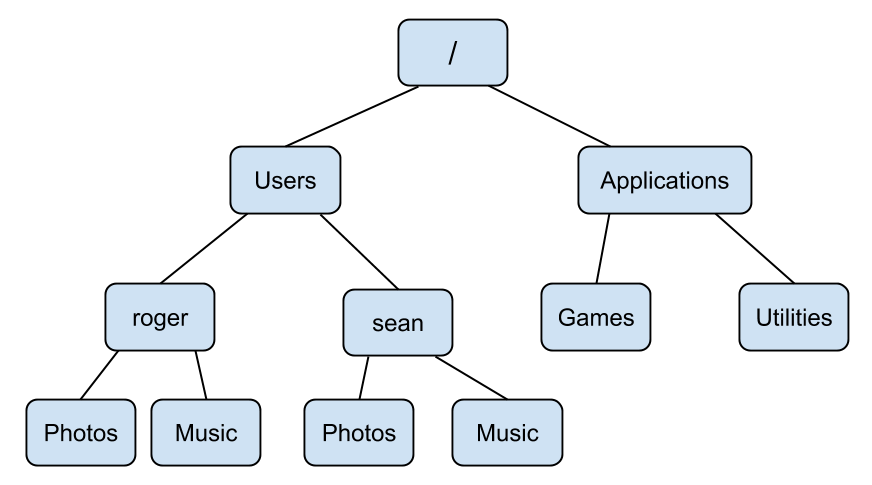
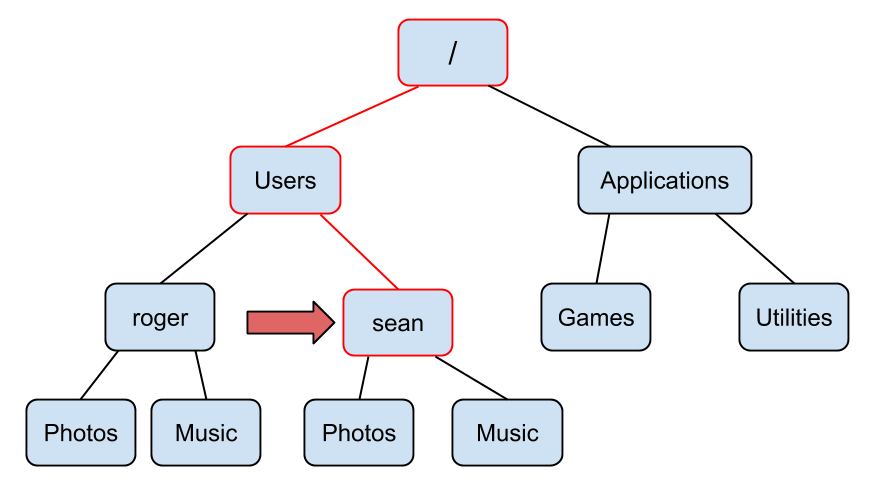

# Command Line Basics

> Of a small spark a great fire. - Gaelic proverb

## Hello Terminal!

Once you have opened up Terminal then you should see a window that 
looks something like this:


What you are looking at is the bash shell! Your shell will surely look different 
than mine, but all bash shells have the same essential parts. As you can see in
my shell it says `seans-air:~ sean$`. This string of characters is called the
**prompt**. You type command line commands after the prompt. The prompt is just
there to let you know that the shell is ready for you to type in a command.
Press `Enter` on your keyboard a few times to see what happens with the prompt.
Your shell should now look like this:


If you don't type anything after the prompt and you press `Enter` then nothing
happens and you get a new prompt under the old prompt. The white rectangle 
after the prompt is just a cursor that allows you to edit what you have typed
into the shell. Your cursor might look like a rectangle, a line, or an
underscore, but all cursors behave the same way. After typing something into
the command line you can move the cursor back and forth with the left and right
arrow keys, just like you would when typing an email.

Now that we have pressed `Enter` several times our shell looks messy with all of 
those old prompts! Do not worry, you are about to learn your first shell command 
which will clear all of those old prompts from your shell. Type `clear` at the 
prompt and then hit `Enter`. Voila! Your shell now only has the current prompt,
just like when you first opened the terminal.

Every command line command is actually a little computer program, even commands
as simple as `clear`. These commands all tend to have the following structure:

```
[command] [options] [arguments]
```

Some simple commands like `clear` do not require any options or arguments.
Options are usually preceded by a hyphen (`-`) and they tweak the behavior
of the command. Arguments can be names of files, raw data, or other options
that the command requires. A simple command that has an argument is `echo`.
The `echo` command prints a phrase to the console. Enter `echo 'Hello World!'`
into the command line to see what happens:


```bash
echo 'Hello World!'
```

```
## Hello World!
```

We will be using the above syntax for the rest of the book, where on one line there
will be a command that I have entered into the command line, and then below that
command the console output of the command will appear (if there is any
console output). You can use `echo` to print any phrase surrounded by single
quotes (`''`) to the console.

If you want to see the last command press the `Up` arrow key. You can press
`Up` and `Down` in order to scroll through the history of commands that you've
entered. If you want to re-execute a past command, you can scroll to that
command then press `Enter`. Try getting back to the `echo 'Hello World!'`
command and execute it again.

### Summary

- You type command line commands after the prompt.
- `clear` will clean up your terminal.
- `echo` prints text to your terminal.
- You can scroll through your command history with the `Up` and `Down` arrow
keys.

### Exercises

1. Print your name to the terminal.
2. Clear your terminal after completing #1.

## Navigating the Command Line

You have learned two command line commands (`clear` and `echo`) which is pretty
good! Before you learn more commands we need to discuss how files and folders 
are organized on your computer.

Computers are organized in a hierarchy of folders, where a folder can contain 
many folders and files. People who use Unix often refer to folders as 
directories and these terms are interchangeable. This directory hierarchy forms 
a tree, like the diagram below. You can use the command line to navigate these
trees on your computer.


As you can see in the image below, my Debussy directory is contained in my Music 
directory. This is the simplest case of how directories are structured.


The directory structure on most computers is much more complicated, but the 
structure on your computer probably looks something like this:



There are a few special directories that you should be aware of on your 
computer. The directory at the top of this tree is called the root directory. 
The root directory contains all other directories, and is represented by a 
slash (`/`). The home directory is another special directory which contains your 
personal files, like your photos, documents, and the contents of your desktop.
The tilde (`~`) represents a shorthand for your home directory. 

Imagine tracing all of the directories from your root directory to the 
directory you are currently viewing. This sequence of directories is called a 
**path**. The diagram below illustrates the path from the root 
directory to a directory called *sean*. This directory happens to be my home
directory.



This path can be written as `/Users/sean`. Since this is my home directory, We
can also use `~` as a shorter way to refer to the same path. We will see this
demonstrated soon.

Open the command line if you closed it. Your shell is always in a directory,
and the directory that your shell starts in your home directory. Whatever 
directory your shell is in is called the **working directory**. Enter the `pwd` command into your shell to **p**rint the **w**orking **d**irectory.


```bash
pwd
```

```
## /Users/sean
```

You can change your working directory using the `cd` command. If you use the
`cd` command without any arguments then your working directory is changed
to your home directory.

Enter `cd` into the command line and then enter `pwd`.


```bash
cd
pwd
```

```
## /Users/sean
```

You were in your working directory to start, and by entering `cd` into the
command line you did technically **c**hange **d**irectory, you just changed it
to your home directory (the directory you were in to begin with). To use `cd` to
change your working directory to a directory other than your home directory, you
need to provide `cd` with the path to another directory as an argument. You can
specify a path as either a path that is **relative** to your current directory,
or you can specify the **absolute** path to a directory starting from the root
of your computer. Let's say we simply want to change the working directory to
one of the folders that is inside our home directory. First we need to be able to
see which folders are in our working directory. You can list the files and
folders in a directory using the `ls` command. Let's use the `ls` command in our
home directory to list the files and folders contained within it.


```bash
ls
```

```
## Desktop
## Documents
## Photos
## Music
## todo.txt
```

It looks like I have four folders and one text file in my home directory. Now
let's switch into the Music directory:


```bash
cd Music
```

As you can see the path to the current working directory has changed:


```bash
pwd
```

```
## /Users/sean/Music
```

I specified a **relative** path when I entered `cd Music`. The path to the 
Music directory is just `Music/` relative to my previous working directory.
I can go back to `/Users/sean/` with the command `cd ..` which changes the
working directory to the folder above the current working directory:


```bash
cd ..
pwd
```

```
## /Users/sean
```

Notice that `..` is also a relative path, since it specifies the directory above
your current working directory. Similarly `.` is the path to your current
working directory. Therefore since my current working directory is `/Users/sean`
then `cd Music` is the same as `cd ./Music`.

I can `cd` to any folder as long as I know the **absolute** path to that folder.
For example I can `cd` to `/Users/sean/Music` by entering the following into 
the shell:


```bash
cd ~/Music
pwd
```

```
## /Users/sean/Music
```

It does not matter what directory the shell is in since we are using an 
absolute path. Therefore we can jump straight to a directory as long as we specify
the absolute path. Notice above that we used `~` as shortcut for `/Users/sean/`. 

Of course you should not expect yourself to have every
absolute path on your computer memorized! You can use a terminal feature called
**tab completion** in order to speed up typing paths and other commands. Enter
the following into your shell, and then try pressing the `Tab` key (on some
machines you need to press it twice):


```bash
cd ~/
```

(press `Tab`)

```
## Desktop
## Documents
## Photos
## Music
## todo.txt
```

Pressing tab shows you a list of all files and folders inside of the `~/`
directory. Now I'm going to type `~/D` into my terminal and you can see what
happens when I press `Tab` again:


```bash
cd ~/D
```

(press `Tab`)

```
## Desktop
## Documents
```

Since I added a "D" to the path, only folders with names that start with a "D"
are listed. If I type `cd ~/De` into the console and then press `Tab` then the
command will autocomplete to `cd ~/Desktop/`. If I press `Tab` again, the console
will list all of the files and folders on my desktop.

Make sure to pause and try this yourself in your own terminal! You will not have
the same files or folders that I do, but you should try using `cd` and tab 
completion with directories and files that start with the same letters.

### Summary

- You can identify a specific file or folder by its path.
- The root directory (`/`) contains all of the folders and files on your
computer.
- Your home directory (`~`) is the directory where your terminal always starts.
- Your terminal is always inside of a working directory.
- When you open your terminal your working directory will be set to the home
directory.
- Use the `cd` command to **c**hange your working **d**irectory.
- The `pwd` command will **p**rint the **w**orking **d**irectory.
- The `ls` command will **l**i**s**t files and folders in a directory.

### Exercises

1. Set your working directory to the root directory.
2. Set your working directory to your home directory using three different 
commands.
3. Find a folder on your computer using your file and folder browser, and then
set your working directory to that folder using the terminal.
4. List all of the files and folders in the directory you navigated to in #3.

## Creation and Inspection

Now that you can fluidly use your terminal to bound between directories all
over your computer, it is time to learn some actions you can perform on folders and
files. One of the first actions you will probably want to take when opening up a
fresh terminal is to create a new folder or file. You can **m**a**k**e a 
**dir**ectory with the `mkdir` command, followed by the path to the new
directory. First let's look at the contents of my home directory:


```bash
cd
ls
```

```
## Desktop
## Documents
## Photos
## Music
## todo.txt
```

Let's create a new directory to store some code files we am going to write
later. We can use `mkdir` to create a new directory called `Code`:


```bash
mkdir Code
ls
```

```
## Desktop
## Documents
## Photos
## Music
## todo.txt
## Code
```

It worked! Notice that the argument `Code` to the command `mkdir` is a relative 
path, however we could have specified an absolute path. In general you should
expect Unix tools that take paths as arguments to accept both relative and
absolute paths.

There are a few different ways to create a new file on the command line. The
most simple way to create a blank file is to use the `touch` command, followed
by the path to the file you want to create. In this example we are going to create
a new journal entry using `touch`:


```bash
touch journal-2017-01-24.txt
ls
```

```
## Desktop
## Documents
## Photos
## Music
## todo.txt
## Code
## journal-2017-01-24.txt
```

A new file has been created! We have been using `ls` to list the files and folders
in the current directory, but using `ls` alone does not differentiate between
which of the listed items are folders and which are files. Thankfully you can
use the `-l` option with `ls` in order to get a **l**ong listing of files in
a directory.


```bash
ls -l
```

```
## drwxr-xr-x  2 sean  staff  68 Jan 24 12:31 Code
## drwxr-xr-x  2 sean  staff  94 Jan 20 12:44 Desktop
## drwxr-xr-x  2 sean  staff  24 Jan 20 12:44 Documents
## drwxr-xr-x  2 sean  staff  68 Jan 20 12:36 Music
## drwxr-xr-x  2 sean  staff  68 Jan 20 12:35 Photos
## -rw-r--r--  1 sean  staff  90 Jan 24 11:33 journal-2017-01-24.txt
## -rw-r--r--  1 sean  staff  70 Jan 24 10:58 todo.txt
```

There is a row in the resulting table for each file or folder. If the entry in the
first column is a `d`, then the row in the table corresponds to a **d**irectory,
otherwise the information in the row corresponds to a file. As you can see in my
home directory there are five directories and two files. The string of
characters following the `d` in the case of a directory or following the first
`-` in the case of a file represent the permissions for that file or directory.
We will cover permissions in a later section. The columns of this table also show
who created the file, the group that the creator of the file belongs to (we will
cover groups later when we cover permissions), the size of the file, the time
and date when the file was last modified, and then finally the name of the file.

Now that we have created a file there are a few different ways that we can inspect
and edit this file. First let's use the `wc` command to view the **w**ord
**c**ount and other information about the file:


```bash
wc todo.txt
```

```
##       3      14      70 todo.txt
```

The `wc` command displays the number of lines in a file followed by the number
of words and then the number of characters. Since this file looks pretty small
(only three lines) let's try printing it to the console using the `cat` command.


```bash
cat todo.txt
```

```
## - email Jeff
## - write letter to Aunt Marie
## - get groceries for Shabbat
```

The `cat` command is often used to print text files to the terminal, despite
the fact that it is really meant to con**cat**enate files. You can see this
concatenation in action in the following example:


```bash
cat todo.txt todo.txt
```

```
## - email Jeff
## - write letter to Aunt Marie
## - get groceries for Shabbat
## - email Jeff
## - write letter to Aunt Marie
## - get groceries for Shabbat
```

The `cat` command will combine every text file that is provided as an argument.

Let's take a look at how we could view a larger file. There is a file inside
the Documents directory:


```bash
ls Documents
```

```
## a-tale-of-two-cities.txt
```

Let's examine this file to see if it is reasonable to read it with `cat`:


```bash
wc Documents/a-tale-of-two-cities.txt
```

```
##      17    1005    5799 Documents/a-tale-of-two-cities.txt
```

Wow, over 1000 words! If we use `cat` on this file it is liable to take up our
entire terminal. Instead of using `cat` for this large file we should use
`less`, which is a program designed for viewing multi-page files. Let's try
using `less`:


```bash
less Documents/a-tale-of-two-cities.txt
```

```
I. The Period

It was the best of times,
it was the worst of times,
it was the age of wisdom,
it was the age of foolishness,
it was the epoch of belief,
it was the epoch of incredulity,
it was the season of Light,
it was the season of Darkness,
it was the spring of hope,
it was the winter of despair,
we had everything before us, we had nothing before us, we were all going direct
Documents/a-tale-of-two-cities.txt
```

You can scroll up and down the file line-by-line using the up and down arrow 
keys, and if you want to scroll faster you can use the `spacebar` to go to the
next page and the `b` key to go to the previous page. In order to quit `less`
and go back to the prompt press the `q` key.

As you can see the `less` program is a kind of Unix tool with behavior that we
have not seen before because it "takes over" your terminal. There are a few
programs like this that we will discuss throughout this book.

There are also two easy to remember programs for glimpsing the beginning or end
of a text file: `head` and `tail`. Let's quickly use `head` and `tail` on
`a-tale-of-two-cities.txt`:


```bash
head Documents/a-tale-of-two-cities.txt
```

```
## I. The Period
## 
## It was the best of times,
## it was the worst of times,
## it was the age of wisdom,
## it was the age of foolishness,
## it was the epoch of belief,
## it was the epoch of incredulity,
## it was the season of Light,
## it was the season of Darkness,
```

As you can see `head` prints the first ten lines of the file to the terminal.
You can specify the number of lines printed with the `-n` option followed by
the number of lines you would like to see:


```bash
head -n 4 Documents/a-tale-of-two-cities.txt
```

```
## I. The Period
## 
## It was the best of times,
## it was the worst of times,
```

The `tail` program works exactly the same way:


```bash
tail Documents/a-tale-of-two-cities.txt
```

```
of an atrocious murderer, and to-morrow of a wretched pilferer who had robbed a
farmer’s boy of sixpence.
All these things, and a thousand like them, came to pass in and close upon the
dear old year one thousand seven hundred and seventy-five. Environed by them,
while the Woodman and the Farmer worked unheeded, those two of the large jaws,
and those other two of the plain and the fair faces, trod with stir enough,
and carried their divine rights with a high hand. Thus did the year one
thousand seven hundred and seventy-five conduct their Greatnesses, and myriads
of small creatures—the creatures of this chronicle among the rest—along the
roads that lay before them.
```

We have now gone over a few tools for inspecting files, folders, and their
contents including `ls`, `wc`, `cat`, `less`, `head`, and `tail`. Before the 
end of this section
we should discuss a few more techniques for creating and also editing files. One
easy way to create a file is using **output redirection**. Output redirection
stores text that would be normally printed to the command line in a text file.
You can use output redirection by typing the greater-than sign (`>`) at the end
of a command followed by the name of the new file that will contain the output
from the proceeding command. Let's try an example using `echo`:


```bash
echo "I'm in the terminal."
```

```
## I'm in the terminal.
```


```bash
echo "I'm in the file." > echo-out.txt
```

Only the first command printed output to the terminal. Let's see if the second
command worked:


```bash
ls
```

```
## Desktop
## Documents
## Photos
## Music
## todo.txt
## Code
## journal-2017-01-24.txt
## echo-out.txt
```


```bash
cat echo-out.txt
```

```
## I'm in the file.
```

It worked! You can also **append** text to the end of a file using
two greater-than signs (`>>`). Let's try this feature out:


```bash
echo "I have been appended." >> echo-out.txt
cat echo-out.txt
```

```
## I'm in the file.
## I have been appended.
```

Now for a **word of warning**. Imagine that I want to append another line to 
the end of `echo-out.txt`, so typed `echo "A third line." > echo-out.txt` into
the terminal when really I meant to type `echo "A third line." >> echo-out.txt`
(notice I used `>` when I meant to use `>>`). Let's see what happens:


```bash
echo "A third line." > echo-out.txt
cat echo-out.txt
```

```
## A third line.
```

Unfortunately we have unintentionally overwritten what was already contained in
`echo-out.txt`. There is no undo button in Unix so we will have to live with this
mistake. This is the first of several lessons demonstrating the damage that you
should try to avoid inflicting with Unix. Make sure to take extra care when
executing commands that can modify or delete a file, a typo in the command can
be potentially devastating. Thankfully there are a few strategies for protecting
yourself from mistakes, including managing permissions for files, and tracking
versions of your files with Git, which we will discuss thoroughly in a later
chapter.

Finally we should discuss how to edit text files. There are several file editors
that are available for your terminal including 
[`vim`](https://en.wikipedia.org/wiki/Vim_(text_editor)) 
and [`emacs`](https://en.wikipedia.org/wiki/Emacs). Entire books have been
written about how to use both of these text editors, and if you are interested
in one of them you should look for resources online about how to use them. The
one text editor we will discuss using is called `nano`. Just like `less`, `nano`
uses your entire terminal window. Let's edit `todo.txt` using `nano`:


```bash
nano todo.txt
```

```
  GNU nano 2.0.6                File: todo.txt

- email Jeff
- write letter to Aunt Marie
- get groceries for Shabbat


^G Get Help   ^O WriteOut   ^R Read File  ^Y Prev Page  ^K Cut Text   ^C Cur Pos
^X Exit       ^J Justify    ^W Where Is   ^V Next Page  ^U UnCut Text ^T To Spell
```

Once you have started `nano` you can start editing the text file. The top line of
the `nano` editor shows the file you are currently working on, and the bottom two
lines show a few commands that you can use in `nano`. The caret character (`^`)
represents the `Control` key on your keyboard, so you can for example type
`Control` + `O` in order to save the changes you have made to the text file, or
`Control` + `X` in order to exit `nano` and go back to the prompt. 

`nano` is a good editor for beginners because it works similarly to word 
processors you have used before. You can use the arrow keys in order to move your
cursor around the file, and the rest of the keys on your keyboard work as
expected. Let's add an item to the to-do list and then we will save and exit `nano`
by typing `Control` + `O` followed by `Control` + `X`.

```
  GNU nano 2.0.6                File: todo.txt

- email Jeff
- write letter to Aunt Marie
- get groceries for Shabbat
- write final section of "command line basics"


^G Get Help   ^O WriteOut   ^R Read File  ^Y Prev Page  ^K Cut Text   ^C Cur Pos
^X Exit       ^J Justify    ^W Where Is   ^V Next Page  ^U UnCut Text ^T To Spell
```

Now let's quickly check if those changes were saved correctly:


```bash
cat todo.txt
```

```
## - email Jeff
## - write letter to Aunt Marie
## - get groceries for Shabbat
## - write final section of "command line basics"
```

You can also create new text files with `nano`. Instead of using an existing
path to a file as the argument to `nano`, use a path to a file that does not
yet exist and then save your changes to that file.

### Summary

- Use `mkdir` to create new directories.
- The `touch` command creates empty files.
- You can use `>` to redirect the output of a command into a file.
- `>>` will append command output to the end of a file.
- Print a text file to the command line using `cat`.
- Inspect properties of a text file with `wc`.
- Peak at the beginning and end of a text file with `head` and `tail`.
- Scroll through a large text file with `less`.
- `nano` is simple text editor.

### Exercises

1. Create a new directory called `workbench` in your home directory.
2. Without changing directories create a file called `readme.txt` inside of 
`workbench`.
3. Append the numbers 1, 2, and 3 to `readme.txt` so that each number appears on
it's own line.
4. Print `readme.txt` to the command line.
5. Use output redirection to create a new file in the `workbench` directory called 
`list.txt` which lists the files and folders in your home directory.
6. Find out how many characters are in `list.txt` without opening the file or
printing it to the command line.

## Migration and Destruction

In this section we will discuss moving, renaming, copying, and deleting files and
folders. First let's revisit the contents of our current working directory:


```bash
ls
```

```
Code
Documents
Photos
Desktop
Music
echo-out.txt
journal-2017-01-24.txt
todo.txt
```

It's gotten a little sloppy, so let's clean this directory up. First we will
make a new directory to store all of the journal entries in called `Journal`. We
already know how to do that:


```bash
mkdir Journal
```

Now we want to move the journal entry `journal-2017-01-24.txt` into the `Journal`
directory. We can **m**o**v**e it using the `mv` command. `mv` takes two
arguments: first the path to the file or folder that you wish to move followed
by the destination folder. Let's try using `mv` now:


```bash
mv journal-2017-01-24.txt Journal
ls
```

```
Code
Documents
Journal
Photos
Desktop
Music
echo-out.txt
todo.txt
```

Looks like it worked! I just realized however that we should move the `Journal`
directory into the `Documents` folder. Thankfully we can do this with `mv` in
the same way:


```bash
mv Journal Documents
ls
```

```
Code
Documents
Photos
Desktop
Music
echo-out.txt
todo.txt
```

Let's just make sure it ended up in the right place:


```bash
ls Documents
```

```
Journal
a-tale-of-two-cities.txt
```

Looks good! Another hidden use of the `mv` command is that you can use it to
rename files and folders. The first argument is the path to the folder or file
that you want to rename, and the second argument is a path with the new name
for the file or folder. Let's rename `todo.txt` so it includes today's date:


```bash
mv todo.txt todo-2017-01-24.txt
ls
```

```
Code
Documents
Photos
Desktop
Music
echo-out.txt
todo-2017-01-24.txt
```

Looks like it worked nicely. Similar to the `mv` command, the `cp` command
**c**o**p**ies a file or folder from one location to another. As you can see `cp` is
used exactly like `mv` when copying files, the file or folder you wish to copy
is the first argument, followed by the path to the folder where you want the
copy to be made:


```bash
cp echo-out.txt Desktop
ls
```

```
Code
Documents
Photos
Desktop
Music
echo-out.txt
todo-2017-01-24.txt
```


```bash
ls Desktop
```

```
echo-out.txt
```

Be aware that there is one difference between copying files and folders, when
copying folders you need to specify the `-r` option, which is short for
*recursive*. This ensures that the underlying directory structure of the
directory you wish to copy remains intact. Let's try copying my `Documents`
directory into the `Desktop` directory:


```bash
cp -r Documents Desktop
ls Desktop
```

```
Documents
echo-out.txt
```

Finally, let's discuss how to delete files and folders with the command line.
**A word of extreme caution:** in general I do not recommend deleting files or
folders on the command line because as we have discussed before there is 
***no undo button*** on the command line. If you delete a file that is critical
to your computer functioning you may cause irreparable damage. I *highly* 
recommend moving files or folders to a designated trash folder and then deleting
them the way you would normally delete files and folders outside of the command
line (The path to the Trash Bin is `~/.Trash` on Mac and `~/.local/share/Trash`
on Ubuntu). If you decide to delete 
a file or folder on your computer make absolutely
sure that the command you have typed is correct before you press `Enter`. If you do
delete a file or folder by accident stop using your computer immediately and
consult with a computer professional or your IT department so they can try to
recover the file.

Now that you have been warned, let's discuss `rm`, the
[Avada Kedavra](https://en.wikipedia.org/wiki/Magic_in_Harry_Potter#Unforgivable_Curses)
of command line programs. When **r**e**m**oving files `rm` only requires the path to a
file in order to delete it. Let's test its destructive power on `echo-out.txt`:


```bash
rm echo-out.txt
ls
```

```
Code
Documents
Photos
Desktop
Music
todo-2017-01-24.txt
```

> I felt a great disturbance in the Force, as if millions of voices suddenly cried out in terror, and were suddenly silenced. - *Obi-wan Kenobi*

The file `echo-out.txt` is gone forever. Remember when we copied the entire
`Documents` directory into `Desktop`? Let's get rid of that directory now. Just
like when we were using `cp` the `rm` command requires you to use the `-r`
option when deleting entire directories. Let's test this battle station:


```bash
ls Desktop
```

```
Documents
echo-out.txt
```


```bash
rm -r Desktop/Documents
ls Desktop
```

```
echo-out.txt
```

Now that the awesome destructive power of `rm` is on your side, you have learned
the basics of the command line! See you in the next chapter for a discussion of
more advanced command line topics.

### Summary

- `mv` can be used for moving or renaming files or folders.
- `cp` can copy files or folders.
- You should try to avoid using `rm` which permanently removes files or folders.

### Exercises

1. Create a file called `message.txt` in your home directory and move it into
another directory.
2. Copy the `message.txt` you just moved into your home directory.
3. Delete both copies of `message.txt`. Try to do this without using `rm`.
