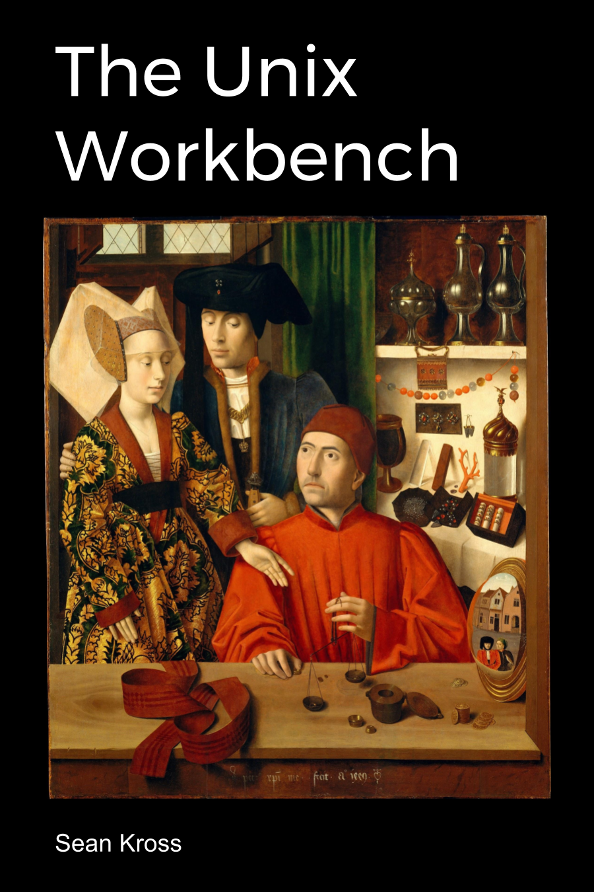

--- 
title: "The Unix Workbench"
author: "Sean Kross"
date: "2019-01-22"
site: bookdown::bookdown_site
output:
 bookdown::html_chapters:
   includes:
     in_header: style.css
documentclass: book
cover-image: "images/cover.png"
bibliography: [book.bib]
biblio-style: apalike
link-citations: yes
github-repo: seankross/the-unix-workbench
url: 'https\://github.com/seankross/the-unix-workbench'
description: ""
---

# Title Page {-}

Cover Image: *A Goldsmith in his Shop* by Petrus Christus

This work by [Sean Kross](http://seankross.com) is licensed 
[CC0](https://creativecommons.org/publicdomain/zero/1.0/). Zero rights reserved.

This book is available for purchase on [Leanpub.com](https://leanpub.com/unix).

This book can be used on its own, however it's also the companion textbook to
a course of the same name on [Coursera.org](https://www.coursera.org/learn/unix).

# Dedication {-}

In memory of Toby Kross.

# Acknowledgements {-}

Thank you to Jeff Leek, Roger Peng, and Brian Caffo for your advice and support.
Also thank you to Jon Calder and Elissa Redmiles for your edits and suggestions.

# Introduction {-}

This book is intended for folks who are new to programming and new to Unix-like
operating systems like macOS and Linux distributions like Ubuntu. Most of the
technologies discussed in this book will be accessed via a command line
interface. Command line 
interfaces can seem alien at first, so this book
attempts to draw parallels between using the command line and actions that you
would normally take while using your mouse and keyboard.
You will also learn how to write little pieces of software in a programming
language called Bash, which allows you to connect together the tools we will
discuss. My hope is that by the end of this book you be able to use different
Unix tools as if they are interconnecting Lego bricks.

Unix forms a foundation that is often very helpful for
accomplishing other goals you might have for you and your computer, whether
that goal is running a business, writing a book, curing disease, or creating
the next great app. The means to these goals are sometimes carried out by
writing software.
Software cannot be mined out of the ground, nor can software seeds be planted in
spring to harvest by autumn. Software is not produced in factories on an
assembly line. Software is a hand-made, often bespoke good. If a software
developer is an artisan, then Unix is their workbench. Unix provides an
essential and simple set of tools in a distraction-free environment. Even if
you are not a software developer learning Unix can open you up to new methods
of thinking and novel ways to scale your ideas. My goal
for this book is to help you get started with Unix by writing the book I would
have wanted when I was first learning Unix. If you have any additions,
corrections, or comments for this book please open an issue or send a pull
request to: https://github.com/seankross/the-unix-workbench. If you are unsure
what a pull request is don't worry, you will find out in the Git and GitHub
chapter of this book!
